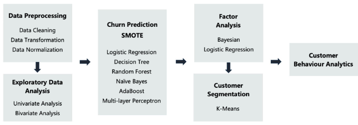
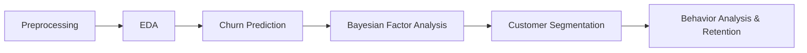
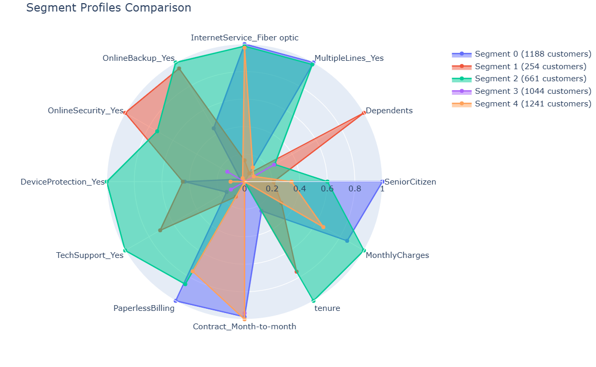
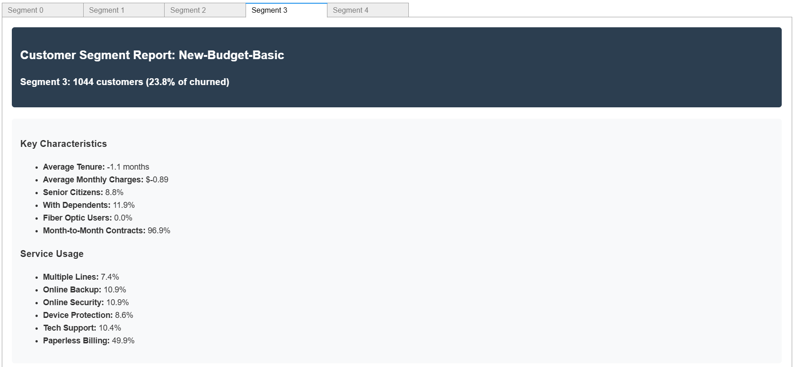
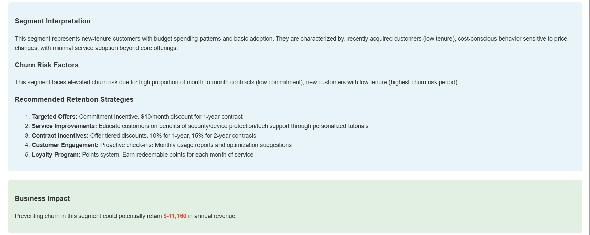
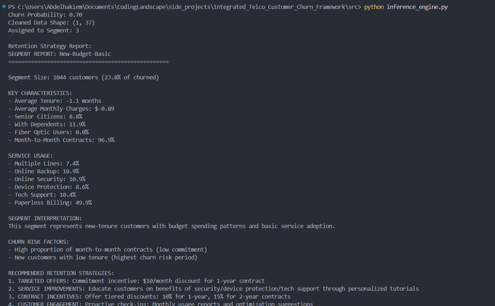

# Integrated Telco Customer Churn Analytics Framework

A comprehensive end‑to‑end pipeline for predicting, analyzing, and managing customer churn in the telecommunications industry.

---

## 📖 Overview

Modern telecom operators face fierce competition and high customer acquisition costs. Retaining existing customers is 5×–10× cheaper than acquiring new ones, yet churn rates remain stubbornly high. This framework integrates four key stages:

1. **Churn Prediction**: Machine‑learning models output churn probabilities. (logistic regression achieved highest recall)
2. **Bayesian Factor Analysis**: Bayesian logistic regression uncovers key drivers of churn and quantifies uncertainty.
3. **Customer Segmentation**: K‑means clustering on churned customers using identified risk/protective factors.
4. **Behavior Analysis & Retention**: Detailed segment profiles inform tailored retention strategies.

---

## 🧩 Business Problem

* **High Acquisition Cost**: Acquiring new customers costs 5–10× more than retaining existing ones.
* **Competitive Landscape**: Multiple operators offer similar services, giving customers many alternatives.
* **Imbalanced Data**: Most customers stay, making churn prediction challenging.

**Goal**: Build an integrated analytics framework that both predicts and explains churn, then segments churned customers for targeted intervention.

---

## 🔬 Datasets

* [Telco Customer Churn (blastchar)](https://www.kaggle.com/datasets/blastchar/telco-customer-churn/data)


---
## 🛠️ Suggested Approach


This pipeline is introduced by: Integrated Churn Prediction and Customer Segmentation Framework for Telco Business, Wu, Shuli, et al (2021)

1. **Data Preprocessing**: Cleaning, transformation, normalization, handling imbalance (e.g. SMOTE).
2. **Exploratory Data Analysis**: Univariate & bivariate analyses to understand distributions and relationships.
3. **Churn Prediction**: Train and compare multiple classifiers (XGBoost, Random Forest, Logistic Regression, etc.), evaluate via precision/recall, F1, ROC‑AUC, calibration curves.
4. **Bayesian Factor Analysis**: Use Bayesian logistic regression to derive odds ratios for each feature, identifying risk vs protective factors.
5. **Customer Segmentation**: Run K‑means on only the churned subset, using factors identified in Step 4.
6. **Behavior Analysis & Retention**: Profile each segment and propose tailored retention measures.

---

## ⚙️ Framework Steps



1. **Preprocessing**: Data cleaning, encoding, scaling.
2. **EDA**: Visualize distributions and correlations.
3. **Churn Prediction**: Probabilistic outputs + uncertainty.
4. **Factor Analysis**: Compute posterior distributions of coefficients → odds ratios → percentage effects.
5. **Segmentation**: Filter churned, cluster on significant features.
6. **Behavior Analysis**: Generate profiles, reports, and retention strategies.

---

## 📊 Example Insights

### Final Report



---

## 📂 Project Structure

```
├── README.md             <- This file
├── data/                 <- Raw, interim, and processed data
├── notebooks/            <- Jupyter notebooks by stage
├── src/                  <- Python package for the framework
│   ├── traaining_pipeline <- preprocessing, model training & evaluation module
│   ├── inference.py       <- churn prediction, segmentation & reporting engine 
│   └── server.py          <- fast api for deployment
├── reports/             <- Generated figures and reports (PDF/HTML)
├── Dockerfile
├── models               <- Trained and serialized models, model predictions, or model summaries
├── reports/             <- Generated analysis
└── requirements.txt     <- Python dependencies
```

---

## 🚀 Getting Started

1. **Clone the repo**:

   ```bash
   git clone https://github.com/Abdelhakiem/Integrated_Telco_Customer_Churn_Framework.git
   ```
2. **Install dependencies**:

   ```bash
   pip install -r requirements.txt
   ```
3. **Train & evaluate models**:

   ```bash
    python main.py
   ```
4. **churn prediction, segmentation & reporting engine**:

   ```bash
   python ./src/inference.py
   ```
   
4. **Running Fast API**:
   ```bash
    python .\src\server.py
   ```
5. **Docker**:
    ```bash
    docker build -t churn-framework 
    docker run -p 8080:8080 churn-framework
    ```


